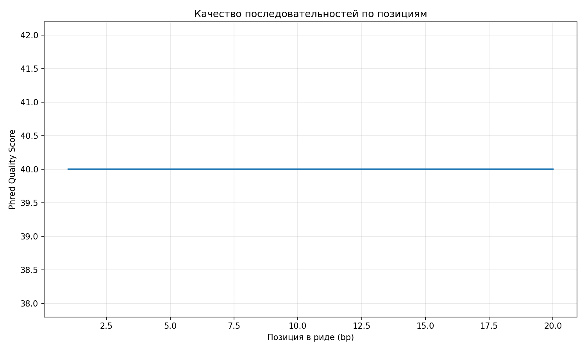
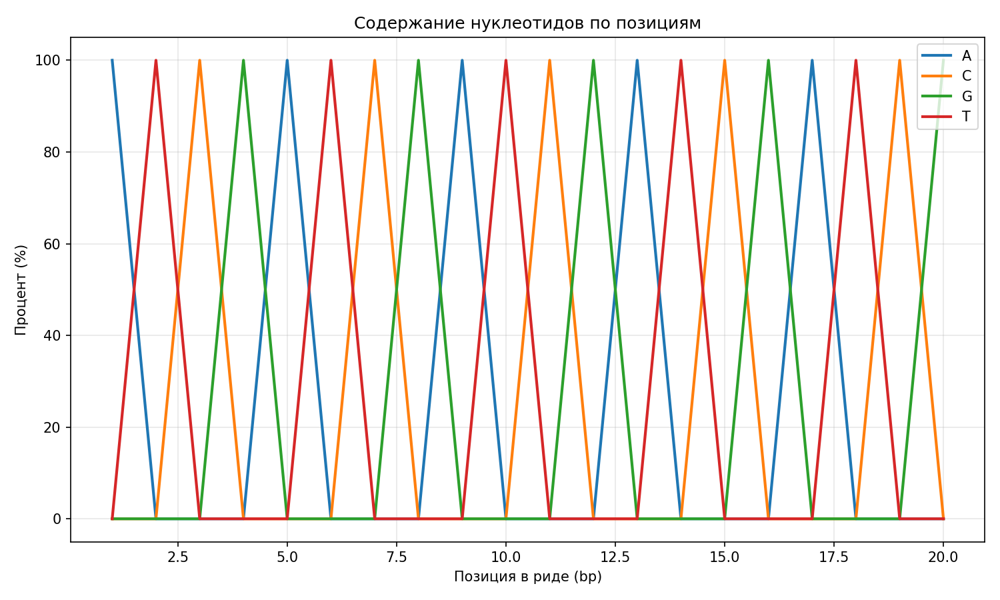
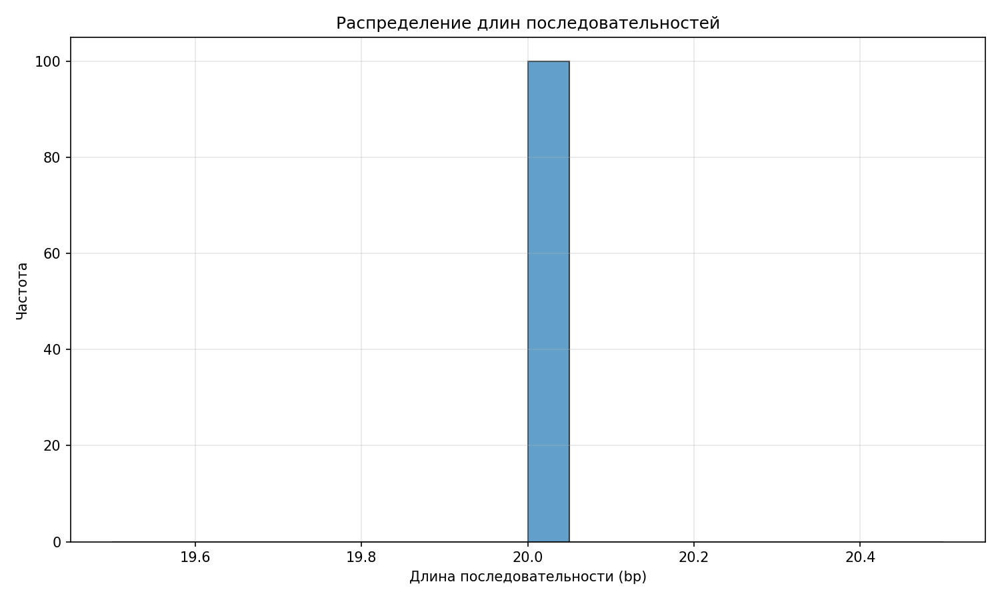

[](https://classroom.github.com/a/I6I1ViQv)
# Bioinformatics Cool

[](https://python.org)

Унифицированный процессор для биологических форматов файлов: FASTA, FASTQ, SAM, VCF.


## Возможности

### Модуль FASTA
- Подсчет последовательностей и статистика
- Расчет средней длины последовательностей
- Эффективные генераторы для больших файлов
- Валидация формата и фильтрация
- Поддержка сжатых файлов (.gz)

### Модуль FASTQ
- Анализ качества чтений
- Статистика последовательностей
- Обработка quality scores
- Фильтрация по порогам качества

### Модуль SAM
- Статистика выравниваний
- Анализ маппинга чтений
- Парсинг CIGAR строк
- Поддержка BAM файлов

### Модуль VCF
- Анализ вариантов (variant calling)
- Обработка генотипов
- Фильтрация по метрикам качества
- Поддержка аннотаций

## Структура проекта
```
bioformats-holygophers/
├── src/
│   └── formats/
│       ├── fasta.py
│       ├── fastq.py
│       ├── sam.py
│       └── vcf.py
├── tests/
│   ├── test_fasta.py
│   ├── test_fastq.py
│   ├── test_sam.py
│   └── test_vcf.py
├── examples/
│   ├── demo_fasta.py
│   ├── demo_fastq.py
│   ├── demo_sam.py
│   └── demo_vcf.py
├── docs/
│   └── source/
│       ├── conf.py
│       ├── index.rst
│       ├── modules.rst
│       └── usage.rst
├── README.md
└── requirements.txt
```
## Установка
Клонируйте репозиторий:

```bash
git clone https://github.com/bioinf-rnrmu-stotoshka/bioformats-holygophers
cd bioformats-holygophers
```

Установите зависимости:
```bash
pip install -r requirements.txt
```

Запустите демонстрационную программу:
```bash
python examples/demo.py
```
---
**Анализ качества чтений:**



**Содержание нуклеотидов:**



**Распределение длин последовательностей:**


```

## Документация

Для генерации документации:

```bash
cd docs
sphinx-build -b html source build
```

Откройте `docs/build/index.html` в браузере.

## Тестирование

Запуск всех тестов:

```bash
python -m pytest tests/
```

Или отдельных модулей:

```bash
python tests/test_fasta.py
python tests/test_fastq.py
python tests/test_sam.py
python tests/test_vcf.py
```
---
## Команда разработки

- Горожанкина П. - разработка FASTQ модуля
- Зубрилина А. - разработка SAM и VCF модуля
- Калион В. - разработка FASTA модуля, документация
